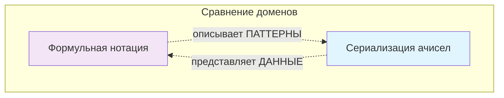

# Нотации МТС: Спецификация систем записи Метатеории связей

## 🎯 **Фундаментальное понимание**

**Ключевое открытие**: 
1. **Четверичные ачисла являются базовой формой полной сериализации ачисел**
2. **Формульная нотация описывает ФОРМЫ СВЯЗЕЙ и утверждения о тождестве**

### 💡 **Архитектурный принцип**
```
Два ортогональных домена: СЕРИАЛИЗАЦИЯ АЧИСЕЛ ↔ ФОРМЫ СВЯЗЕЙ
```

## 🧩 **Основные концепции МТС**

### 🧮 **Абиты (ассоциативные биты)**

**Определение**:  
Абиты — это четыре базовые связи вокруг акорня, которые формируют элементарные "строительные блоки" ассоциативной памяти. Они задают состояния **4-значной логики** и используются для сериализации связей, т.е. адресации в ассоциативной памяти.

**Конкретные абиты**:  

1. `(` - абит начала связи (♂∞ ≡ ♂∞ → ∞)
   - **Описание**: начало связи, т.е. ссылка
   - **Инверсия от**: `)`
   - **Смысл**: Активация процесса, передача, открытие контекста описания новой связи

2. `)` - абит конца связи (∞♀ ≡ ∞ → ∞♀)
   - **Описание**: конец связи, т.е. значение
   - **Инверсия от**: `(`
   - **Смысл**: Завершение процесса, приём, закрытие контекста описания новой связи

3. `+` - абит наличия связи (→ ≡ ♂∞ → ∞♀ ≡ true)
   - **Описание**: наличие связи или просто связь
   - **Инверсия от**: `-`
   - **Смысл**: Истина, существование, утверждение

4. `-` - абит отсутствия связи (↛ ≡ ∞♀ → ♂∞ ≡ false)
   - **Описание**: отсутствие связи или просто несвязь
   - **Инверсия от**: `+`
   - **Смысл**: Ложь, несуществование, отрицание

**Критическое уточнение**:
- ∞ (ассоциативный корень) **НЕ является абитом**
- ∞ НЕ входит в состав четверичного ачисла  
- ∞ может быть выражен через комбинацию абитов: `()` ≡ ∞
- Только указанные 4 символа являются абитами для четверичной системы: `(`, `)`, `+`, `-`
- Любое ачисло как чистая четверичная последовательность содержит ТОЛЬКО эти 4 абита
- ∞ существует на мета-теоретическом уровне, но НЕ сериализуется в четверичных последовательностях

**Назначение**:  
- Формирование четырёхзначных **ачисел** (ассоциативных чисел) — последовательностей связей
- Кодирование логических операций (например, `+` ≡ истина, `-` ≡ ложь)
- Построение структур сетей связей через комбинации абитов (например, `"ab(c)"`)

### 📐 **Виды форм связей**

**Определение**:  
Это категории, классифицирующие связи по их **структурным особенностям** и **самозамыканию**. Виды форм связей — **теоретические категории** для анализа структуры связей (метатеоретический уровень).

**Основные виды**:  

1. **Полностью самозамкнутая связь** (∞)
   - Пример: ∞ → ∞
   - **Свойство**: Нульарный оператор, есть только одна полностью самозамкнутая связь, это акорень ∞

2. **Связь с самозамкнутым началом** (♂)
   - Пример: ♂∞ → ∞
   - **Свойство**: Унарный оператор

3. **Связь с самозамкнутым концом** (♀)
   - Пример: ∞ → ∞♀
   - **Свойство**: Унарный оператор

4. **Связь без самозамыканий** (→)
   - Пример: ♂∞ → ∞♀
   - **Свойство**: Бинарный левоассоциативный оператор

**Назначение**:  
- Анализ структурных свойств связей
- Определение поведения связей (например, рекурсия, передача данных)
- Классификация для формализации аксиом и правил вывода

### 🔄 **Сравнение абитов и форм связей**

| **Критерий**       | **Абиты**                          | **Виды форм связей**                |  
|---------------------|------------------------------------|--------------------------------------|  
| **Роль**            | Элементарные логические состояния | Категории для классификации связей  |  
| **Примеры**         | `(`, `)`, `+`, `-`                | ∞→∞, ♂∞→∞, ∞→∞♀, ♂∞→∞♀                |  
| **Использование**   | Построение ачисел и операций      | Теоретический анализ структуры      |  
| **Инверсия**        | Чётко определена (напр., `+` ↔ `-`)| Зависит от контекста                |

#### **Примеры взаимодействия**
1. **Абит `+`** (♂∞ → ∞♀) относится к виду **связей без самозамыканий**
2. **Абит `(`** (♂∞ → ∞) относится к виду **связей с самозамкнутым началом**
3. **Акорень** (∞ → ∞) — это **полностью самозамкнутая связь**, основа системы

### 🎯 **Смысл и назначение**
- **Абиты**:  
  - Практическая реализация четырёхзначной ассоциативной логики и сериализации связей
  - Аналогичны битам в классических вычислениях, но адаптированы для МТС

- **Виды форм связей**:  
  - Теоретический инструмент для анализа и проектирования связей
  - Помогают формализовать аксиомы (например, аксиому бесконечности: ∞ ≡ ∞→∞)

Это разделение позволяет МТС сохранять гибкость:  
- Абиты обеспечивают практическую применимость (как биты в компьютере)
- Виды связей — глубину анализа (как типы в математике)

## 🏗️ **Архитектура: Два ортогональных домена**

Система нотаций МТС работает в **двух полностью разделённых доменах**:

### 🔷 **Домен 1: СЕРИАЛИЗАЦИЯ АЧИСЕЛ**
**Назначение**: Сериализация и десериализация структур данных ачисел

1. **Полная сериализация ачисел** (полная, базовая)
2. **Строковые ачисла** (человекочитаемый формат)
3. **Четверичные ачисла** (базовая форма для ассоциативной памяти)

### 🔶 **Домен 2: ФОРМЫ СВЯЗЕЙ**
**Назначение**: Описание абстрактных паттернов связей и метатеоретических отношений

1. **Формульная нотация МТС** (описание форм связей)

### 🚨 **ВАЖНО**: Эти домены **ОРТОГОНАЛЬНЫ** - они описывают разные сущности!

## 📊 **Диаграмма взаимосвязей доменов**

```
graph TB
    subgraph "ДОМЕН СЕРИАЛИЗАЦИИ АЧИСЕЛ"
        A[Полная сериализация ачисел]
        B[Строковые ачисла] 
        C[Четверичные ачисла - БАЗОВЫЕ]
        
        A --> |компактная форма| C
        B --> |расширяется в| A
        B --> |компактная форма| C
        C -.-> |может быть расширена| A
    end
    
    subgraph "ДОМЕН ФОРМ СВЯЗЕЙ"
        D[Формульная нотация МТС]
    end
    
    D -.-> |описывает паттерны| A
    D -.-> |НЕ сериализация| A
    
    style A fill:#e1f5fe
    style C fill:#fff3e0
    style D fill:#f3e5f5
```

## 🔷 **ДОМЕН 1: СЕРИАЛИЗАЦИЯ АЧИСЕЛ**

### 1.1 Полная сериализация ачисел

#### 📋 Определение
**Полная сериализация ачисел** — это полное, безпотерь представление структур ачисел, сохраняющее всю семантическую информацию и контекст.

#### 🔤 Алфавит символов
```
Базовые абиты: ( ) + -
```

#### 📝 Примеры
```
Простое расширение: ((+))
Сложная структура: ((((+-))-)(()))
Многомерное: (+)((-))(())(+(-)(+))
```

### 1.2 Строковые ачисла

#### 📋 Определение
**Строковые ачисла** обеспечивают человекочитаемую сериализацию с использованием символов UTF-8, служащую мостом между полной сериализацией и четверичными формами.

#### 📝 Примеры
```
"пользователь + активный"
→ пользователь+активный

"обработка данных - завершена"
→ обработка+данных-завершена

"система (состояние) готова"
→ система(состояние)готова
```

### 1.3 Четверичные ачисла (Базовая форма для ассоциативной памяти)

#### 📋 Определение
**Четверичные ачисла** — это **базовая форма** представления данных, оптимизированная для операций ассоциативной памяти, использующая только 4 символа. Это не вырожденная форма, а **специализированный формат** для высокопроизводительных операций.

#### ⚡ **Особенности базовой формы**
- **Минимальный алфавит**: Только 4 символа для максимальной скорости обработки
- **Оптимизация**: Специально разработана для ассоциативной памяти
- **Эффективность**: Компактное представление для критичных по производительности задач
- **Полнота**: Способна представить любые данные через последовательности абитов

#### 📝 Примеры
```
Простые структуры:
(+)              # Базовое значение
((+-))-          # Сложная структура

Кодирование символов:
Символ 'A' = 01000001₂ = (-+-----+)  # Прямое bit-to-abit преобразование
Символ 'B' = 01000010₂ = (-+----+-)  # Каждый бит → соответствующий абит
```

#### 🎯 **Применение**
- **Ассоциативная память**: Адресация и индексирование
- **Высокопроизводительные системы**: Минимальные затраты на обработку
- **Криптография**: Четверичное кодирование
- **Встроенные системы**: Оптимизация ресурсов

## 🔶 **ДОМЕН 2: ФОРМЫ СВЯЗЕЙ**

### 2.1 Формульная нотация МТС

#### 📋 Определение
**Формульная нотация МТС** описывает абстрактные паттерны связей, их формы и отношения на метатеоретическом уровне. Она **НЕ** сериализует ачисла.

#### 🎯 **ФУНДАМЕНТАЛЬНЫЙ ПРИНЦИП**
> Формульная нотация работает с **ФОРМАМИ СВЯЗЕЙ**, а не с сериализацией ачисел

#### 🔤 Символы описания форм
```
Операторы форм:
→   Направление формы связи
≡   Эквивалентность формы
≢   Неэквивалентность формы
↛   Отсутствие формы связи

Паттерны форм:
∞   Саморефлексивный паттерн формы
♂   Саморефлексивная форма источника
♀   Саморефлексивная форма значения
()  Группировка форм (НЕ абиты!)
```

#### 📝 Примеры форм связей

##### Базовые паттерны:
```
♂∞♀ ≡ (♂∞)♀                # Саморефлексивная форма связи
∞ → ∞ → ∞ ≡ ∞               # Каскадная форма бесконечности
♂♀ ≡ ∞                      # Утверждение эквивалентности формы
```

##### Формы саморефлексии:
```
♂v ≡ ♂v → v                 # Паттерн саморефлексии источника
r♀ ≡ r → r♀                 # Паттерн саморефлексии значения
∞ ≡ ∞ → ∞                   # Бесконечная саморефлексия
```

### 2.2 Примеры разделения доменов

#### ❌ **НЕПРАВИЛЬНОЕ СМЕШИВАНИЕ**:
```
♂∞♀ ≡ "сериализованная_строка"    # ОШИБКА: смешивание доменов
```

#### ✅ **ПРАВИЛЬНОЕ РАЗДЕЛЕНИЕ**:
```
ФОРМА СВЯЗИ (Формула):        ♂∞♀ ≡ (♂∞)♀
СЕРИАЛИЗАЦИЯ АЧИСЛА (Строка): "пользователь + данные"

Это РАЗНЫЕ СУЩНОСТИ в РАЗНЫХ ДОМЕНАХ
```

## 🔄 **Междоменные отношения**

### 🎯 **Границы доменов**


### 📊 **Отношения внутри домена ачисел**

```
graph LR
    A[Полная сериализация] ↔ B[Строковые ачисла]
    A --> |компактная форма| C[Четверичные ачисла]
    B --> |компактная форма| C
    C -.-> |может быть расширена| A
    
    style A fill:#e1f5fe
    style B fill:#e8f5e8
    style C fill:#fff3e0
```

### ⚠️ **Критические границы**
- **Никогда не смешивать операторы формул с сериализацией ачисел**
- **Никогда не рассматривать формулы как данные ачисел**
- **Никогда не сериализовать формулы как ачисла**

## 📋 **Заключение**

### 🎯 **Ключевые принципы**

#### **Общее для всех нотаций:**
- 🔗 Базовые абиты: `( ) + -`
- 🔗 Круглые скобки `()` работают одинаково

#### **Отличия нотаций:**

| Нотация | Назначение | Пример |
|----------|------------|--------|
| Полная сериализация | Полное сохранение | `((+))` |
| Строковые ачисла | Человекочитаемость | `"текст + данные"` |
| Четверичные ачисла | Высокая скорость | `(+)` |
| Формульная нотация | Описание форм | `♂∞♀ ≡ (♂∞)♀` |

### 🚀 **Архитектурное преимущество**

Система МТС обеспечивает:
- **Конкретную обработку данных** (сериализация)
- **Абстрактный анализ паттернов** (формулы)
- **Оптимизацию производительности** (компактные формы)
- **Полное сохранение информации** (когда нужно)